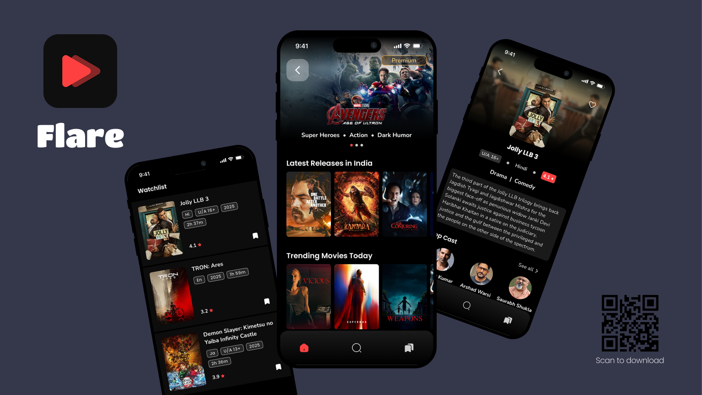

<h1 align="center">Flare: Movie App</h1>

Flare is a movie app that helps you explore a huge collection of movies and TV shows using The Movie
Database [TMDB](https://developer.themoviedb.org/) API. You can discover trending titles, see
detailed information, search for anything
you like, and bookmark your favorites to watch later — all in one simple app.

## Technologies used:

* [Jetpack Compose](https://developer.android.com/compose) - Android's recommended modern toolkit
  for building native UI.
* [Kotlin](https://kotlinlang.org/) - First class and official programming language for Android
  development.
* [Retrofit](https://square.github.io/retrofit/) a REST Client for Android which makes it relatively
  easy to retrieve and upload JSON (or other structured data) via a REST based webservice.
* [Dagger Hilt](https://dagger.dev/hilt/) for dependency injection.
* [ViewModel](https://developer.android.com/topic/libraries/architecture/viewmodel) to store and
  manage UI-related data in a lifecycle conscious way.
* [Flow](https://developer.android.com/kotlin/flow) for handling asynchronous data streams.
* [Material Design](https://m3.material.io/) an adaptable system of guidelines, components, and
  tools that support the best practices of user interface design.
* [Room](https://developer.android.com/topic/libraries/architecture/room) persistence library which
  provides an abstraction layer over SQLite to allow for more robust database access while
  harnessing the full power of SQLite.
* [Coil](https://coil-kt.github.io/coil/) - An image loading library for Android backed by Kotlin
  Coroutines.
* [Firebase](https://firebase.google.com/) - is a platform developed by Google for creating mobile
  and web applications.

## License

```
MIT License

Copyright (c) 2025 Souvik Mondal

Permission is hereby granted, free of charge, to any person obtaining a copy
of this software and associated documentation files (the "Software"), to deal
in the Software without restriction, including without limitation the rights
to use, copy, modify, merge, publish, distribute, sublicense, and/or sell
copies of the Software, and to permit persons to whom the Software is
furnished to do so, subject to the following conditions:

The above copyright notice and this permission notice shall be included in all
copies or substantial portions of the Software.

THE SOFTWARE IS PROVIDED "AS IS", WITHOUT WARRANTY OF ANY KIND, EXPRESS OR
IMPLIED, INCLUDING BUT NOT LIMITED TO THE WARRANTIES OF MERCHANTABILITY,
FITNESS FOR A PARTICULAR PURPOSE AND NONINFRINGEMENT. IN NO EVENT SHALL THE
AUTHORS OR COPYRIGHT HOLDERS BE LIABLE FOR ANY CLAIM, DAMAGES OR OTHER
LIABILITY, WHETHER IN AN ACTION OF CONTRACT, TORT OR OTHERWISE, ARISING FROM,
OUT OF OR IN CONNECTION WITH THE SOFTWARE OR THE USE OR OTHER DEALINGS IN THE
SOFTWARE.
```